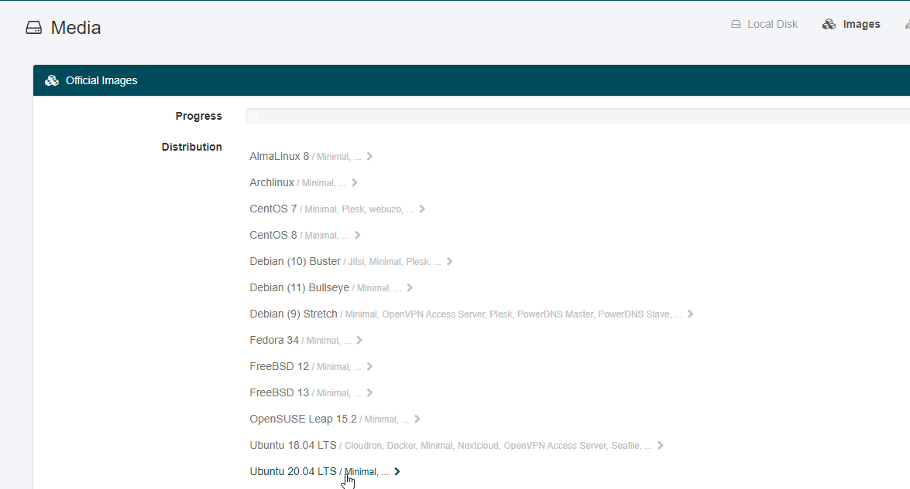

# Docker installation

Below is a end-to-end step-by-step guide with the most important steps.

## **Create a VPS server**

You need to rent a VPS server to host your node on. There are several companies on the market. I have been using [Netcup ](https://www.netcup.eu)for the past few months and so far they have a great specs/price ratio.

Their [VPS 500 G8](https://www.netcup.eu/bestellen/produkt.php?produkt=2006) for 5.29 Euro/month server is sufficient for our needs. They have 10% off with vouchers, which unfortunately have one time use, so I have created another page with such vouchers which you can find by clicking on this [LINK](netcup-vouchers.md).

Another option is more renowned company [Digital Ocean](https://m.do.co/c/1d27b4354b73) (click on the link to get $100 free referral credit for 2 months) is on the higher price range but with great support and reliability (starting from $10/month with 2 GB).

Netcup:

Once you place the order, you will get a callback to confirm the order and you will get your login details. With Netcup you have [account](https://www.customercontrolpanel.de/start.php) control panel and [server ](https://www.servercontrolpanel.de/SCP/Home)control panel. Login to your server contorl panel, select your server from the right corner, select Media on the left, then Images on the right:

.png>)

Then select Ubuntu 20.04 LTS on the next screen:



Then click on "Minimal / minimal system with ssh preinstalled" and then enter again your password for the Server Control page. You will receive an e-mail once the server is ready, and proceed further with the guide.

Digital Ocean:

Select the Marketplace and choose docker on the top right corner, Shared CPU Basic, and the $10/month server.

.png>)


Once the server is setup, you will receive an e-mail (see it within the VPS interface) with the login instructions and server IP, which we will use later.

Video guide will be coming up shortly with the updated instructions for xDAI. In the meantime you can follow the previous one I made for Ethereum, it is pretty much the same, though some of the steps on the guide are not needed for xDAI (Infura, config file is different, etc.). Use it as reference, but don’t follow it step by step.



OriginTrail is integrated with a number of blockchains and each requires slightly different setup. The guide will break down here separately for each Blockchain – xDAI, Ethereum, StarFleetChain (once live in Q4 2021) etc.

## I. Obtain xDAI and xTRAC

xDAI

xDAI is the gas fee currency on the xDAI chain. Given that the gas fees there are very low, 1-2 xDAI will last you a long time. There are multiple ways to obtain it:

* You can obtain DAI from [Uniswap ](https://info.uniswap.org/token/0x6b175474e89094c44da98b954eedeac495271d0f)or [Curve ](https://curve.fi). Then you convert it through the bridge [https://bridge.xdaichain.com/](https://bridge.xdaichain.com) – here is a video tutorial how to do it: [https://www.youtube.com/watch?v=oKdh2cOOqUs](https://www.youtube.com/watch?v=oKdh2cOOqUs) This operation would cost one Ethereum smart contract transaction.
* Buy xDAI directly from [Bitmax](https://bitmax.io/en/basic/cashtrade-spottrading/usdt/xdai). If you have USDT on Binance, send the USDT through TRX network to Bitmax (so it costs $1 for the transfer).
* Use the faucet to get 0.01 xdai -> [https://blockscout.com/xdai/mainnet/faucet](https://blockscout.com/xdai/mainnet/faucet)
* If the faucet is not working, join the OriginTrail Community telegram and as for a cent of xDAI -> [https://t.me/OriginTrailCommunity](https://t.me/OriginTrailCommunity)

xTRAC

xTRAC is wrapped TRAC on other chains. You can convert TRAC tokens to xTRAC using the Omni Bridge. Go to [https://omni.xdaichain.com/](https://omni.xdaichain.com) Instructions how to use the bridge can be found here: [https://docs.tokenbridge.net/eth-xdai-amb-bridge/multi-token-extension/ui-to-transfer-tokens/transfer-erc20](https://docs.tokenbridge.net/eth-xdai-amb-bridge/multi-token-extension/ui-to-transfer-tokens/transfer-erc20)

The custom token contract to see xTRAC on your Metamask on xDAI is:

```
0xEddd81E0792E764501AaE206EB432399a0268DB5
```

Once you have sorted out your xDAI and xTRAC, you need to add the Custom RPC for xDAI, so you can switch your Metamask to the xDAI network. Easiest way to do it is to go to: [https://chainlist.org/](https://chainlist.org) , click on Connect Wallet in the top right corner and then click “Add me to metamask” button on xDAI section.

 (1).png>)

Then you will see on your Metamask xDAI entry when you click on the dropdown on the top where it says Ethereum Mainnet:

.png>)

## II. Prepare the wallets

**Create operational wallet** and management wallets

Create a new wallet using Mycrypto or Metamask and export the private key, which we will use for the operational wallet for the node. Deposit the amount of xTRAC you want to have on your node, which is minimum 3000 xTRAC to secure the network + additional xTRAC to be able to accept jobs. Currently around 5-6k total xTRAC is recommended. Also send 0.1 xDAI for gas fees during installation and litigation responses. For your management wallet, best approach is to use a hardware wallet like [Ledger Nano S](https://shop.ledger.com/pages/ledger-nano-x?r=c912d8040032) or [Trezor](https://shop.trezor.io/?offer\_id=10\&aff\_id=7122).

## III. **Configure the server**

Download [Termius](https://www.termius.com) (or any other terminal client like [Kitty](https://www.fosshub.com/KiTTY.html)) and configure it with the details you received from the VPS hosting (IP, username, password). Click on Hosts, Select New host, Choose a Label for the node and add the IP address from the confirmation e-mail from Netcup or Digital Ocean that the node is created, choose root as username and input the password, and click on Save on the right top corner.

.png>)

Once you login follow the configuration logic below. Click on the COPY button after each command and **right click** into the terminal window to paste it. Then confirm with Enter

### **1. Update the server programs:**

```
apt update && apt upgrade -y
```

.png>)

If you see this notice, choose the first option:

 (1).png>)

### **2. Reboot server with below command, close the window and login again**

```
reboot
```

### **3. Install docker** (skip this step if you selected the Digital Ocean Server with Docker installation).

The official installation commands for docker can be found here, should the ones in this section become outdated: [https://docs.docker.com/engine/install/ubuntu/](https://docs.docker.com/engine/install/ubuntu/)

```
apt-get install apt-transport-https ca-certificates curl software-properties-common
```

```
curl -fsSL https://download.docker.com/linux/ubuntu/gpg | sudo apt-key add -
```

```
add-apt-repository "deb [arch=amd64] https://download.docker.com/linux/ubuntu  $(lsb_release -cs)  stable"
```

```
apt-get update
```

```
apt-get install docker-ce
```

### **4. Setup the firewall**

```
ufw allow 8900 && ufw allow 5278 && ufw allow 3000 && ufw allow 22/tcp
```

**Activate and double check the firewall is properly configured:**

```
ufw enable && ufw status
```

.png>)

### **5. Setup the configuration file**

```
nano /root/.origintrail_noderc
```

Paste the below in the text editing tool and update the configuration accordingly:

```
{
   "blockchain": {
     "implementations": [
       {
         "blockchain_title": "xDai",
         "network_id": "xdai:mainnet",
         "identity_filepath": "xdai_erc725_identity.json",
         "dh_price_factor" : "1",
         "node_wallet": "xxxxxxxx",
         "node_private_key": "xxxxxxxx",
         "management_wallet": "xxxxxxxx"
       } 
     ]
   },
   "network": {
     "hostname": "xxx.xxx.xxx.xxx"
     },
   "initial_deposit_amount": "5000000000000000000000",
   "dh_max_holding_time_in_minutes": 530000,
   "dh_maximum_dataset_filesize_in_mb": 10,
   "dataset_pruning": {
      "enabled": true,
      "imported_pruning_delay_in_minutes": 1440,
      "replicated_pruning_delay_in_minutes": 1440,
      "low_estimated_value_datasets": {
        "enabled": false,
        "minimum_free_space_percentage": 30
}
}
}
```

save the file by **Ctrl-O** and **Enter** and exit by **Ctrl-X**

**Explanation:**

i**nitial\_deposit\_amount** – amount of xTRAC you want to deposit on your node during the installation (so you skip step 10). (5000000000000000000000 is equal to 5000 xTRAC)

**node\_wallet** – Operational wallet public address

**node\_private\_key** – Operational wallet private key. As you will store just 0.1 xDAI there for gas fees, even if server gets compromised, the hacker would have access only to this small amount

**Note**: If your private key start with **0x**, remove these two characters when adding it to the configuration file.

**management\_wallet** – this is your management wallet public address – ideally this should be a wallet on your cold storage ([Ledger Nano S](https://shop.ledger.com/pages/ledger-nano-x?r=c912d8040032), [Trezor](https://shop.trezor.io/?offer\_id=10\&aff\_id=7122), etc.)

**dh\_price\_factor** – this is the setting of your lambda value – should be less than 1 if you want to accept most of all current jobs. The lower the value, the less paid jobs you are willing to accept.

**Hostname** – this is your server IP, which you can find in the notification e-mail when you setup the VPS

**dh\_max\_holding\_time\_in\_minutes** – the maximum length of jobs you are willing to accept in minutes (for example 550 000 is to accept one year jobs).

### **6. Install JQ to validate whether the configuration file doesn’t contain any errors**

```
apt-get install jq
```

```
jq "." /root/.origintrail_noderc
```

Check the brackets, double quotes and commas. Everything except your data has to be exactly like the example above.

### **7. Initiate the node installation**

**Important**: Once you run this command, the TRAC will be deposited to the contract and your first task is to copy and back your ERC725 identity and node identity mentioned on Step 8 below, so you can have control over this deposited amount. Should you get an error at this stage, or if the gas setting you used is too low, do not delete the container or destroy the VPS. Instead join the discord channel or the Official Telegram group to ask for assistance

```
sudo docker run -i --log-driver json-file --log-opt max-size=1g --name=otnode -p 8900:8900 -p 5278:5278 -p 3000:3000 -v ~/.origintrail_noderc:/ot-node/.origintrail_noderc origintrail/ot-node:release_mainnet
```

Once completed and node has joined the network (**Make sure you wait and see it**), exit the log with CTRL +C. If you interrupt the process before the node connecting to the network, you will need to spend some extra time fixing it so please be patient.

The first installation runs in interactive mode, and when you click CTRL + C, you both exit the log and stop the node. Thus one additional start command is required.

```
docker restart otnode
```

### **8. Create identities into files on the root directory**

ERC725 identity

```
docker cp otnode:/ot-node/data/xdai_erc725_identity.json ~/xdai_erc725_identity.json
```

Node ID

```
docker cp otnode:/ot-node/data/identity.json ~/identity.json
```

### **9. Read erc725 and node id and copy/paste them in secure document**

```
more xdai_erc725_identity.json
```

```
more identity.json
```

Or Login to the server using WINSCP or any other FTP application, go to the root folder and download these two files on your local server and archive them with a password.

### **10. Deposit additional xTRAC from your management wallet to the node**

If you want to deposit more than the initial amount, you can deposit the amount of xTRAC which will be available for jobs through the node profile management page at this URL: [https://node-profile.origintrail.io/](https://node-profile.origintrail.io)

The current recommended amount is 2000-3000 xTRAC in addition to the 3000 xTRAC required to secure the network, and they have to be present on your management wallet, which should be on a cold storage device like [Ledger Nano S](https://shop.ledger.com/pages/ledger-nano-x?r=c912d8040032) or [Trezor](https://shop.trezor.io/?offer\_id=10\&aff\_id=7122). If you have not secured your crypto holdings on cold storage, please do so now as this is the best way to keep your funds secure.

Login with your XDAI **ERC725 Identit**y which you extracted above and the **operational wallet public address** and follow the instructions on the page. You need metamask to initiate the deposit.

Then on the top left section “Deposit TRAC to Your Node”, enter the amount of TRAC present on your management wallet, to be deposited to the contract for your node, and a set of 2 transactions have to be processed. Metamask popup will show up for you to confirm you want to process the transaction. Once the first transaction is processed, a second popup will show for the second transaction.

Once the deposit is completed, restart your node.

```
docker restart otnode
```

### **11. Enable auto restart and follow the log to monitor the operation of the node**

```
docker update --restart=always otnode
```

```
docker logs -f otnode
```

### **12. Monitor your node**

You can add your node to the OT Hub and monitor how many jobs has the node won, initiate manual payouts and quickly check if your node is online. The OT Hub can be found on the link below:

[https://othub.origin-trail.network/dashboard](https://othub.origin-trail.network/dashboard)

Also in the **Node Maintenance** section (menu on the right) you can find how to setup notifications on your mobile.

### **13. Add swap space**

Swap space is dedicated space on your hard drive, which is used as RAM should the hardware RAM is fully utilized. This usually slows down the server as the hard drive is slower than the RAM, however the swap would ensure the node will continue operation. I highly recommend to enable 1 GB Swap space on your server.

* check if there is swap space already enabled (SWAP line should show 0)

```
free -h
```

* Add 1 GB Swap space

```
fallocate -l 1G /swapfile
```

* enable the swap file

```
chmod 600 /swapfile
```

* mark the space as swap file

```
mkswap /swapfile
```

* enable for utilisation

```
swapon /swapfile
```

* confirm it is setup (SWAP line should show 1)

```
free -h
```

.png>)

* make it permanent

```
cp /etc/fstab /etc/fstab.bak
```

```
echo '/swapfile none swap sw 0 0' | sudo tee -a /etc/fstab
```

### **14. Install Fail2ban**

This tool allows you to ban any user who failed to login successfully to the server after three attempts. This ensures your server cannot be bruteforced by automated bots, running millions of combinations to try to guess your password.

```
apt install -y fail2ban
```

```
systemctl start fail2ban
```

```
systemctl enable fail2ban
```

Configure the application

```
nano /etc/fail2ban/jail.local
```

Paste the following content in the file editor

```
[sshd] 
enabled = true
port = 22
filter = sshd
logpath = /var/log/auth.log
maxretry = 3
```

Save with CTRL + O and Enter and exit with Ctrl + X. Then restart the process with

```
systemctl restart fail2ban
```

